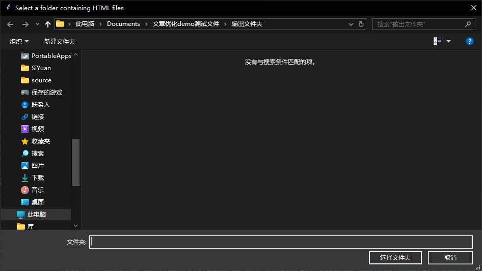
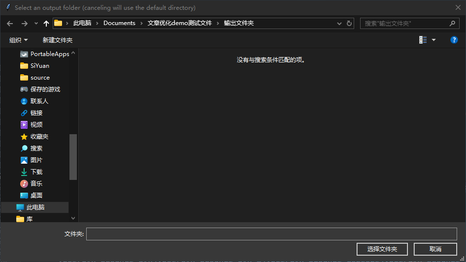
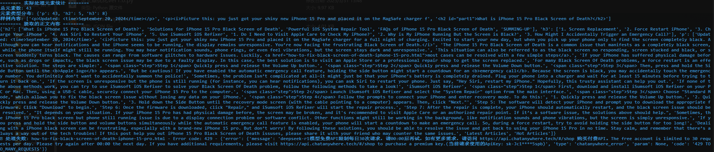
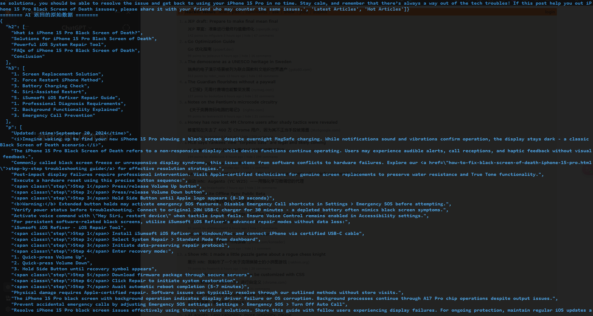
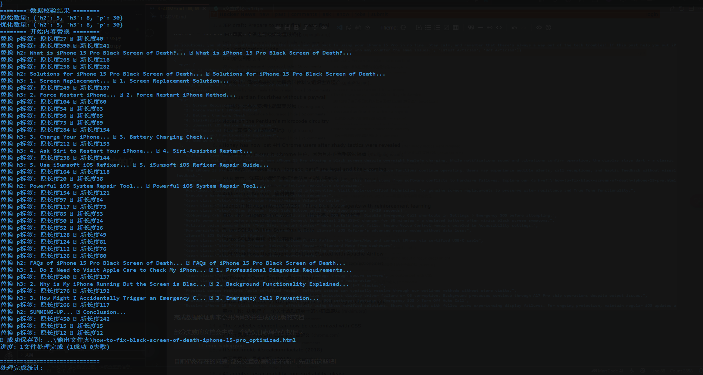

# Optimize_post_ai 使用文档

This is a Python-based project for optimizing articles within the website, which can customize the AI model, give AI instructions, modify density and maximum token, etc. The author made this tool to facilitate the work, hoping to help others.

这是一个基于 Python 的项目，用于大规模优化网站内的文章。它可以自定义 AI 模型、提供 AI 指令、修改密度和最大 Token,支持数据验证等。作者创建此工具是为了提升工作效率，并希望能帮助他人。

#### (**WARNING!** still in development!)

#### (**警告!** 功能不完善,仍在开发中!)

###### Mon Mar 31 17:14:00 CST 2025

更新日志：添加了工具文件夹.

## 如何使用?

首先,定义文章主要内容(正文)在哪一个div(容器)里面,代码部分如下:

```python
    product_main = soup.select_one('div.product-main') 
    # important, this is the main content of your post, make sure your main content inside this div
```

div.product-main即为包含你文章所有内容的div

接下来我们需要定义一些规则来过滤掉一些你不希望AI优化的部分:

```python
    # 使用CSS选择器排除product-content、product-div及其子元素

    main_content = product_main.select(
        '''
        :not(div.product-div):not(div.product-div *):not(div.product-content):not(div.product-content *),
        h2,
        h3,
        p:not(:has(img))
        '''
    )
```

这个代码就是排除了div.main-content里面的div.product-div以及div.product-content两部分,然后包括文章内正文的h2,h3以及p标签内的内容,因为p标签部分嵌套img所以过滤掉了.

然后你可以试试运行代码,首先他会要求你定义你需要优化的文章的文件夹以及输出优化过文章的文件夹(最好两个文件夹是在同一个磁盘里面的,不然容易报错):





(如果没有选择输出文件夹则在默认的输入文件夹输出)

然后他会提取你文章中的内容来生成一个数组:



数组中是你需要优化的内容即可,接下来我们需要配置AI的模型和api_key，给到ai的指令以及转发地址等:

代码如下:

```python
    # 调用 OpenAI API
    client = OpenAI(
        api_key="# 你的api_key", 
        base_url="https://api.chatanywhere.tech/v1" # 调用api的地址
        )
  
    response = client.chat.completions.create(
        model="deepseek-r1",
        messages=[
            {"role": "system", "content": "You are a helpful assistant that optimizes text."},
            {"role": "user", "content": f"严格遵循以下要求优化文本:\n1. 保持原始h2/h3/p标签的数量和顺序,不要随意的合并标签,只是对标签内容进行优化\n2. Role: SEO Optimization Specialist | Language: English | Expertise: SEO strategies & best practices | Skills: Technical SEO (audit, schema, sitemaps, speed), Content Optimization (keywords, on-page, quality, internal linking) | Rules: Ethical SEO, transparency, continuous learning, user experience focus | Workflows: Audit, keyword research, content optimization, performance monitoring | Goal: Improve website visibility & organic traffic.\n3. 返回JSON格式: {{'h2': [...], 'h3': [...], 'p': [...]}}\n4. 不要添加任何解释性文字\n5. 确保每个数组元素数量与原始数据完全一致\n\n原始内容结构统计:\n{original_counts}\n\n待优化内容:\n{cleaned_text}"}
        ], #里面的第二条指令n2是给AI的指令,可以根据需要修改.
        temperature=1,  # 控制生成文本的随机性
        max_tokens=4000,  # 控制生成文本的长度
    )
```

当然这些命令和模型你可以自定义,我这里只是定义一个优化的简单指令.

然后再次执行,等待一段时间等AI返回数据后,

完成数据验证脚本会开始替换并生成优化版的文档



部分失败的文档会生成一个错误日志保存在根目录.


目前仍然存在的问题: 部分文章数据验证不通过. 先更新这些吧!
